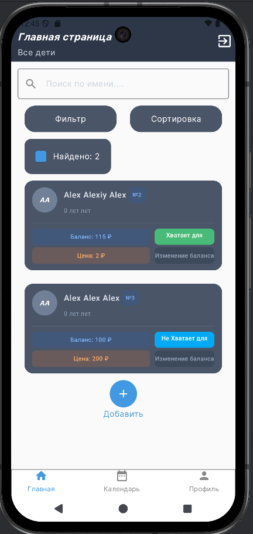
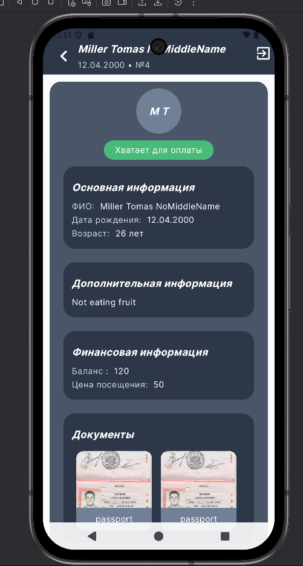
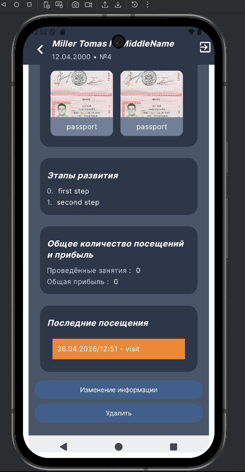
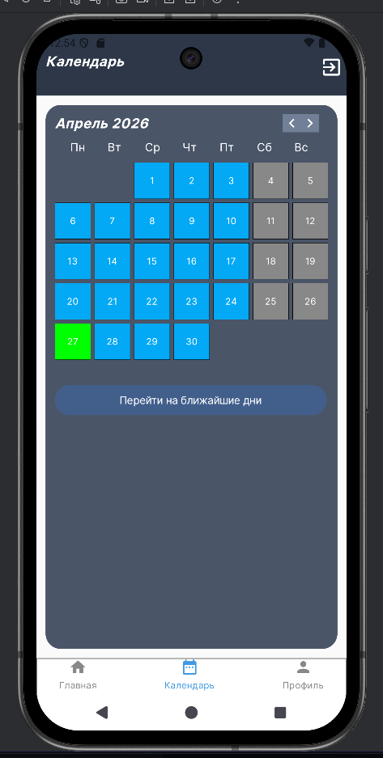
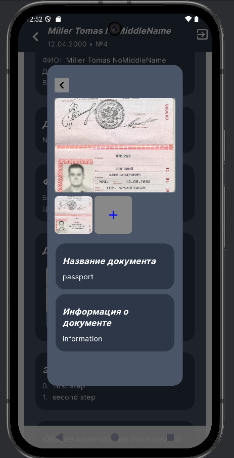
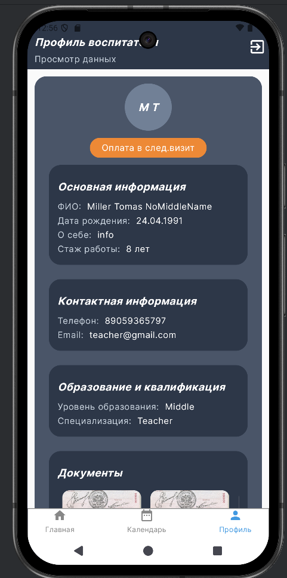
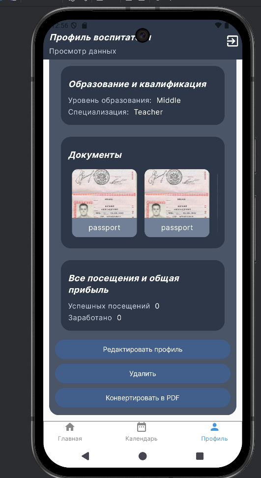

[README.md](https://github.com/user-attachments/files/27235439/README.md)
<div align="center">

# 🧒 WizKids

### Личный помощник воспитателя

*Мобильное приложение для педагогов, воспитателей и репетиторов —*  
*заменяет бумажные журналы, разрозненные заметки и ручной учёт финансов.*

<br>


</div>

---

## 📱 Скриншоты

<div align="center">

| Главный экран | Профиль ребёнка |
|:---:|:---:|
|  |  |

| Календарь | Документы | Профиль специалиста |
|:---:|:---:|:---:|
|  |  |  |

</div>

---

## ✨ Возможности

| Модуль | Описание |
|--------|----------|
| 👥 **Управление детьми** | Профили воспитанников с фото, документами и этапами развития |
| 💰 **Финансовый учёт** | Баланс, история оплат, стоимость занятий, автоматический пересчёт |
| 📅 **Умный календарь** | Визуализация посещаемости, история визитов, счётчик успешных занятий |
| 🔍 **Поиск и фильтрация** | Сортировка по любым параметрам — имя, дата, статус оплаты |
| 👤 **Профиль специалиста** | Экспорт данных в PDF, персональная информация |
| 🌗 **Адаптивный дизайн** | Поддержка светлой и тёмной темы, плавные анимации |
| ✅ **Надёжность** | Полная обработка ошибок и состояний загрузки |

---

## 🏗 Архитектура

Проект построен на **Clean Architecture** с модульной структурой — каждый модуль независим, переиспользуем и компилируется отдельно, что ускоряет сборку.

```
WizKids/
├── app/                        # Entry point, навигация
│
├── core/
│   ├── core-data/              # Room, DAO, Repository impl, маппинг
│   ├── core-domain/            # Модели, репозитории (интерфейсы), Use Cases
│   ├── core-navigation/        # NavRoutes — единые маршруты навигации
│   ├── core-ui/                # Shared-компоненты, тема, утилиты UI
│   ├── core-util/              # Вспомогательные утилиты
│   └── core-viewModel/         # Базовые ViewModel
│
└── feature/
    ├── feature-main/                    # Главный экран
    ├── feature-childInformation/        # Карточка ребёнка
    ├── feature-addNewOrChangeInfoChild/ # Добавление / редактирование ребёнка
    ├── feature-addNewOrChangeInfoUser/  # Редактирование профиля специалиста
    ├── feature-calendarScreen/          # Экран календаря
    ├── feature-upcomingDates/           # Предстоящие занятия
    └── feature-userProfile/             # Профиль специалиста
```

### Ключевые архитектурные решения

- **Single Activity** — вся навигация через Jetpack Compose Navigation, единый lifecycle, упрощённое управление состояниями
- **MVVM** — чёткое разделение UI и бизнес-логики через ViewModel + StateFlow
- **Repository Pattern** — слой данных полностью скрыт за интерфейсами из `core-domain`
- **Use Cases** — каждая бизнес-операция инкапсулирована в отдельный класс

---

## 🛠 Технологический стек

| Категория | Технология |
|-----------|-----------|
| **Язык** | Kotlin 1.9+ |
| **UI** | Jetpack Compose, Material 3 |
| **Навигация** | Jetpack Compose Navigation |
| **База данных** | Room (TypeConverters, миграции) |
| **DI** | Koin |
| **Асинхронность** | Coroutines, StateFlow |
| **Сериализация** | Gson |

---

## 🚀 Установка и запуск

### Требования

- Android Studio Hedgehog или новее
- Android SDK 34+
- Kotlin 1.9+
- Gradle 8.0+

### Шаги

```bash
# 1. Клонировать репозиторий
git clone https://github.com/your-username/WizKids.git

# 2. Открыть в Android Studio
# File → Open → выбрать папку WizKids

# 3. Синхронизировать Gradle и запустить
# Run → Run 'app'  (Shift + F10)
```

Приложение работает полностью офлайн — интернет-соединение не требуется.

---

## 📬 Контакты

Вопросы, баги, предложения — пишите:

**vladislav.yurshin.work@yandex.ru**
